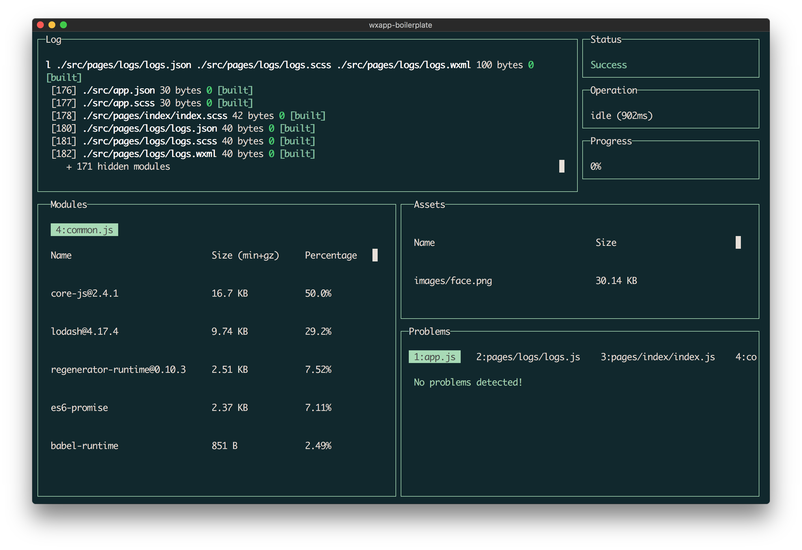

# wxapp-boilerplate
使用 `webpack`, `babel`, `scss` 开发的微信／支付宝小程序项目脚手架

🎉【2017-12-2】支持自动打包 `tabbar` 图标，无需 `copy-webpack-plugin` 等额外配置

## 功能

- 支持引用 `node_modules` 模块
- 支持通过配置 `alias` 来避免 `../../../` 之类的模块引用
- 通过 `babel` 支持更丰富的 `ES6` 兼容，包括 `async/await`
- 内置 `promise` 和 `lodash`（`lodash` 按需引入相应模块，不会全部引入）
- 使用 `scss` 编写 `.wxss` 文件，内置了一些有用的 `mixins` 和 `extends`
- 提供 `__DEV__` 和 `process.env.NODE_ENV` 全局常量辅助开发
- 支持自动编译为微信和支付宝小程序
- 提供 `__WECHAT__` 和 `__ALIPAY__` 全局常量来判断是微信小程序或支付宝小程序
- 通过命令行快速创建微信小程序页面
- 支持在 `production` 环境下压缩代码

## 开始使用

确保安装了 [Node.js](https://nodejs.org/) (>= `v4.2`) 和 [yarn](https://yarnpkg.com) 或 [npm](https://www.npmjs.com/package/npm)

1. `git clone` 此项目
2. 通过命令行工具 `cd` 到这个目录，执行 `yarn` 安装依赖模块
3. 执行 `yarn start` 开始开发
4. 通过微信开发者工具，添加 `dist/wechat` 目录到项目上

## 内置命令

- `yarn start` 启动 `webpack` 开发微信小程序项目，能监听文件变化自动重新编译
- `yarn start:alipay` 启动 `webpack` 开发支付宝小程序项目，能监听文件变化自动重新编译
- `yarn build` 编译生成 `production` 环境的代码到 `dist/wechat` 和 `dist/alipay`
- `yarn create-page` 快速创建微信小程序页面（更多 `create-page` 的用法，请查看 [create-wxapp-page](https://github.com/cantonjs/create-wxapp-page)）

## 兼容微信和支付宝小程序

开发者可以选择一套源代码来开发微信和支付宝小程序，这脚手架支持自动编译 `wxml` 为 `axml`，转换 `wx:attr` 为 `a:attr`，转换 API `wx` 为 `my`，反之亦然。但个别接口在平台上也略有差异，开发者可以通过 `__WECHAT__` 或 `__ALIPAY__` 来动态处理。

## 更新日志

[Changelog](/CHANGELOG.md)

## 相关项目

- [create-wxapp-page](https://github.com/cantonjs/create-wxapp-page)
- [react-lib-boilerplate](https://github.com/cantonjs/react-lib-boilerplate)
- [front-end-lib-boilerplate](https://github.com/cantonjs/front-end-lib-boilerplate)
- [node-cli-boilerplate](https://github.com/cantonjs/node-cli-boilerplate)

## License

MIT
